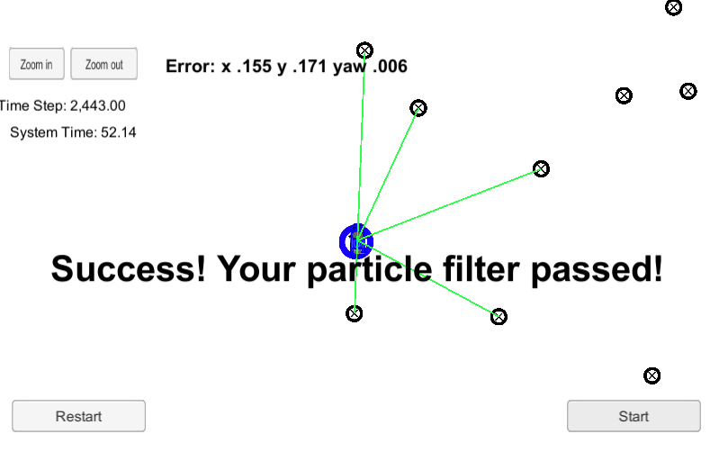
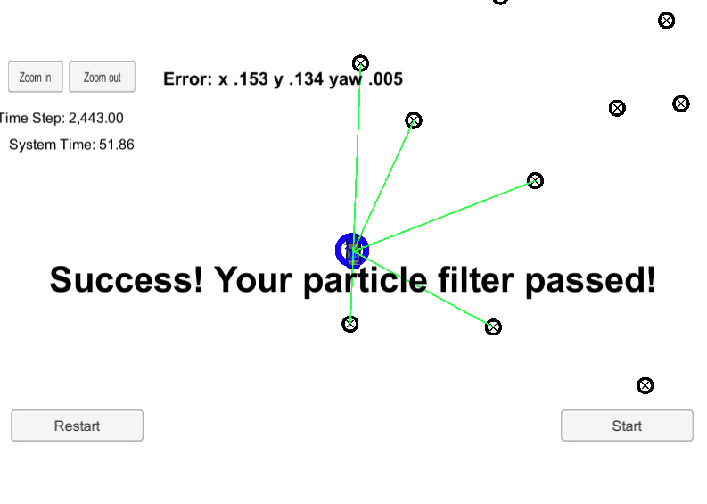
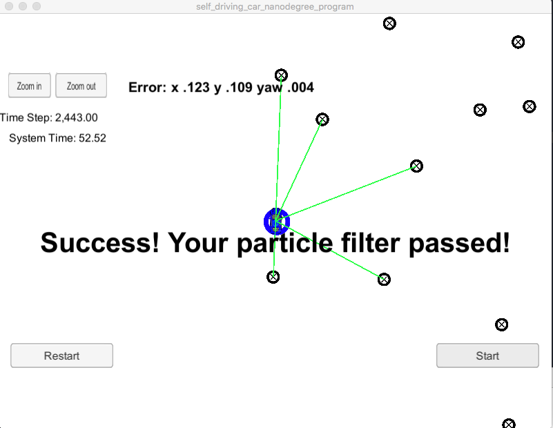
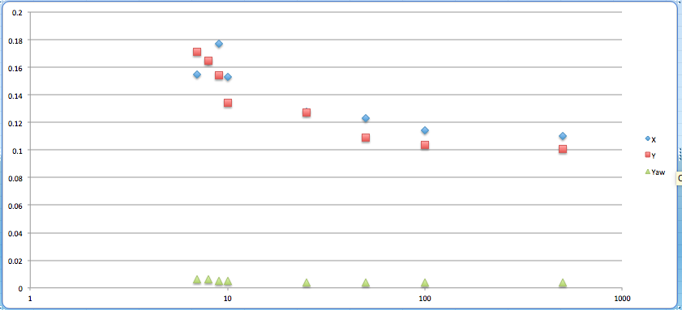

# Kidnapped Vehicle Project
Self-Driving Car Engineer Nanodegree Program

This project is designed to implement the pipeline for a Particle Filter using the statistical analysis, spatial predictions and resample of weights described in the lesson.  The base project code can be found [here](https://github.com/udacity/CarND-Kidnapped-Vehicle-Project)

## Basic Build Instructions
(From original project repo)

1. mkdir build
2. cd build
3. cmake ..
4. make
5. ./particle_filter

# Some trials with different particle counts

# Particle Counts

This data generally shows that the count of particles is directly correlated with the accuracy of the filter as seen with the reduction of error across X, Y, and Yaw.  I wanted to see if there was a minimum number of particles for an effective filter and I found that 7 was a minimum before the implementation hung and couldnt calculate an error.  I speculate that the resampling with such low counts of particles with the given error distribution results in an empty set.  But as the number of particles increases there is not a great reduction in error, perhaps there is a point where the particles are saturating the area within the sensor range.